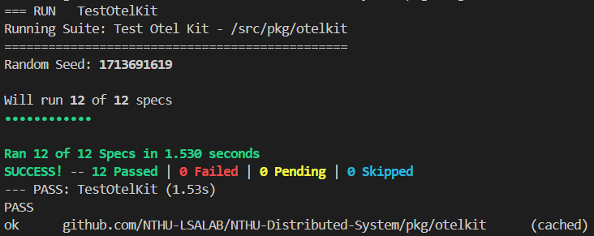
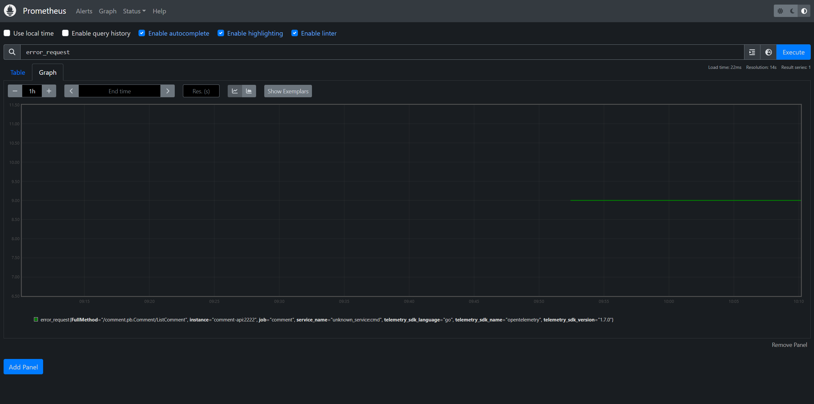

# NTHU-Distributed-System

The repository includes microservices for the NTHU Distributed System course lab. The goal of this project is to **introduce a production, realworld microservices backend mono-repo architecture** for teaching purpose.

Before going through the following parts, make sure your Docker is running since we are generating/testing/building code inside a Docker container to prevent dependencies from conflicting/missing on your host machine.

## Lab Prometheus Result
- Test your implementation in the otelkit package

- Verify your implementation of the interceptor
I try the following api: `http://localhost:10081/v1/comments/1`

## Features

The video service serves APIs that accept uploading a video, listing videos, getting a video and deleting a video.

The comment service serves APIs that accept creating a comment under a video, listing comments under a video, updating a comment and deleting a comment.

Many popular tools that are used in the realworld applications are adopted in this project too. For example:

- Use [gRPC](https://grpc.io/) for defining APIs and synchronous communications between microservices. See the [comment module protocol buffer definition](modules/comment/pb/rpc.proto) for example.
- Use [gRPC-gateway](https://github.com/grpc-ecosystem/grpc-gateway) to generate a HTTP gateway server that serves RESTful APIs for the gRPC APIs. The purpose of having a HTTP gateway server is that realworld web applications typically do not use gRPC for communication.
- Use [PostgreSQL](https://www.postgresql.org/) in the comment service and [MongoDB](https://www.mongodb.com/) in the video service as the DBMS. The microservices architecture allows services to use different databases.
- Use [Redis](https://redis.io/) for cache. Realworld backend services use cache to speed up application performance. Redis is one of the most popular caching system and it is easy to learn.
- Use [Kafka](https://kafka.apache.org/) for asynchronous communications between microservices. Realworld backend services typically rely on message queue systems to accomplish asynchronous communications between microservices.
- Use [MinIO](https://min.io/) storing files. Realworld backend services typically store user uploaded files in cloud storage like Google Cloud Storage or AWS S3. MinIO is a AWS S3 compatible storage system that allows the project to upload files without having a real cloud environment.
- Use [OpenTelemetry](https://opentelemetry.io/) to collect telemetry data.
- Use [Prometheus](https://prometheus.io/) as the metrics backend.
- Use [Kubernetes](https://kubernetes.io/) as the container management system for deployment. Deployment yaml files are in the [k8s](k8s/) directory.

Share libraries are wrapped so that they can be extended easily. For example, logs, traces, and metrics can be easily added to the custom share libraries. Share libraries are in the [`pkg`](./pkg/) directory.

## Code Generation

Some modules use gRPC for communication or use the `mockgen` library for unit testing.

So there is a need to generate code manually when the code changed.

For generating code for all modules, run `make dc.generate`.

For generating code for a single module, run `make dc.{module}.generate`. For example: `make dc.video.generate`.

## Unit Testing

We implements unit testing on the DAO and service layers using the [ginkgo](https://onsi.github.io/ginkgo/) framework.

To run unit testing for all modules, run `make dc.test`.

To run unit testing for a single module, run `make dc.{module}.test`. For example: `make dc.video.test`.

## Style Check

We use [golangci-lint](https://github.com/golangci/golangci-lint) for linting.

To run linting for all modules, run `make dc.lint`.

To run linting for a single module, run `make dc.{module}.lint`. For example: `make dc.video.lint`.

## Build Image

To build docker image, run `make dc.image`.

## CI/CD

The CI/CD runs in [Github Actions](https://github.com/features/actions). See the [CI workflow spec](.github/workflows/main.yml) and the [CD workflow spec](.github/workflows/deployment.yml) for more details.
